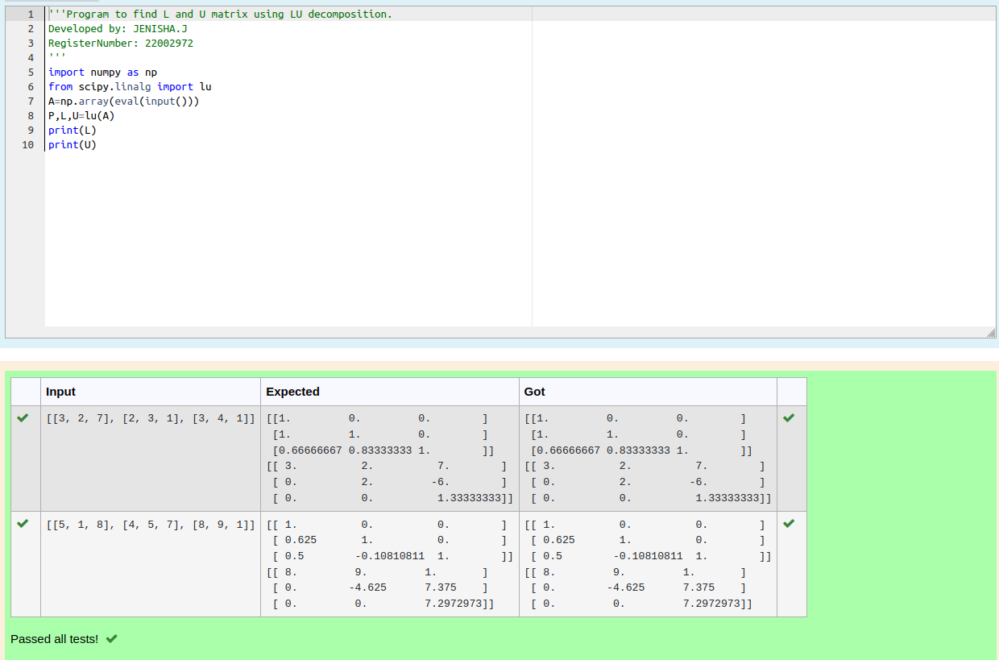
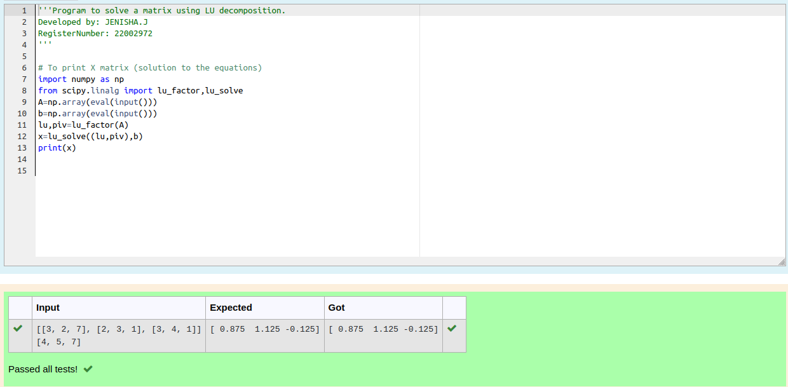

# LU Decomposition 

## AIM:
To write a program to find the LU Decomposition of a matrix.

## Equipments Required:
1. Hardware – PCs
2. Anaconda – Python 3.7 Installation / Moodle-Code Runner

## Algorithm
1. Import the numpy module to use built-in functions for calculation.
2. Import lu package, lu_factor and lu_solve from scipy.linalg module.
3. Using lu_factor() and lu_solve(), we can find the solutions.
4. End the program.

## Program:
(i) To find the L and U matrix
```python
Program to find L and U matrix using LU decomposition.
Developed by: JENISHA.J
RegisterNumber: 22002972

import numpy as np
from scipy.linalg import lu
A=np.array(eval(input()))
P,L,U=lu(A)
print(L)
print(U)
```
(ii) To find the LU Decomposition of a matrix
```python
Program to solve a matrix using LU decomposition.
Developed by: JENISHA.J
RegisterNumber: 22002972

# To print X matrix (solution to the equations)
import numpy as np
from scipy.linalg import lu_factor,lu_solve
A=np.array(eval(input()))
b=np.array(eval(input()))
lu,piv=lu_factor(A)
x=lu_solve((lu,piv),b)
print(x)
```
## Output:




## Result:
Thus the program to find the LU Decomposition of a matrix is written and verified using python programming.

